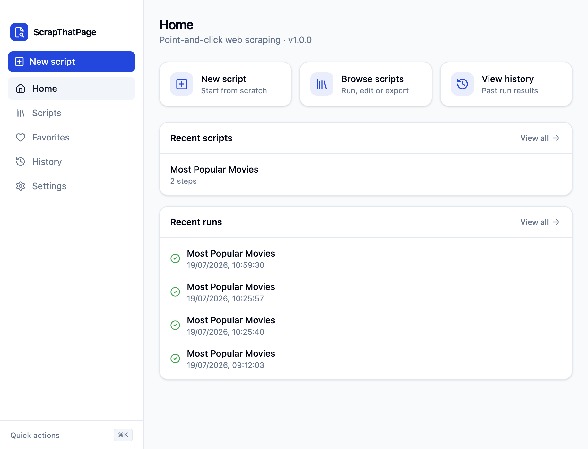
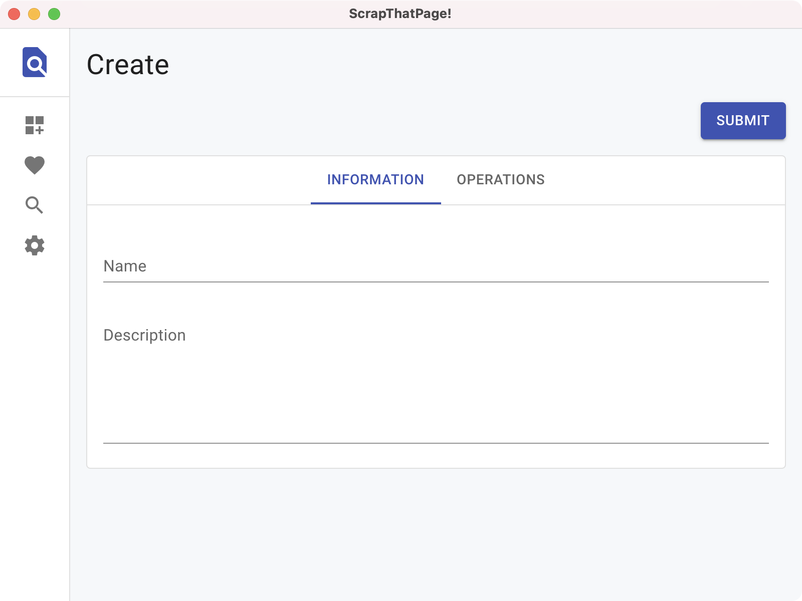
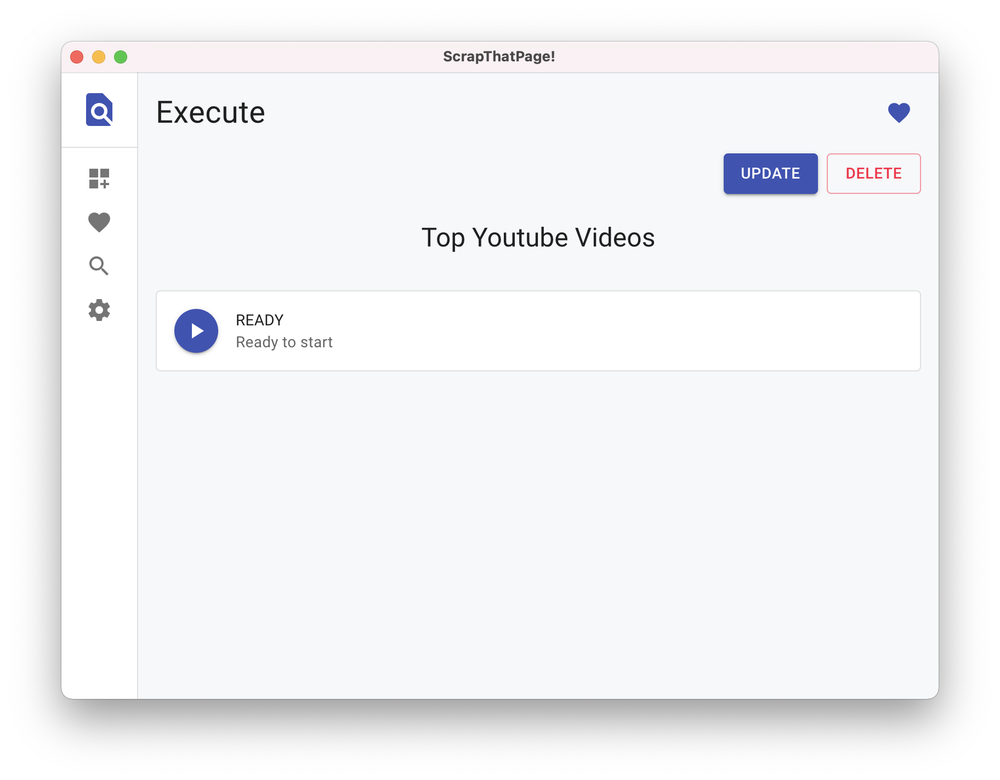
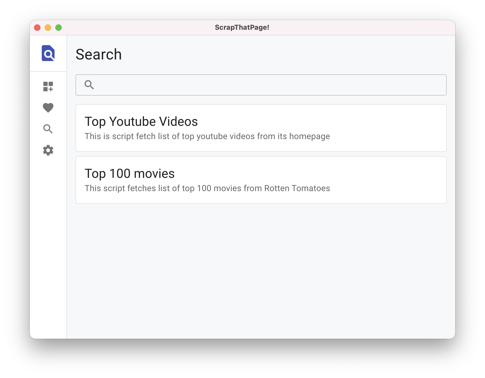
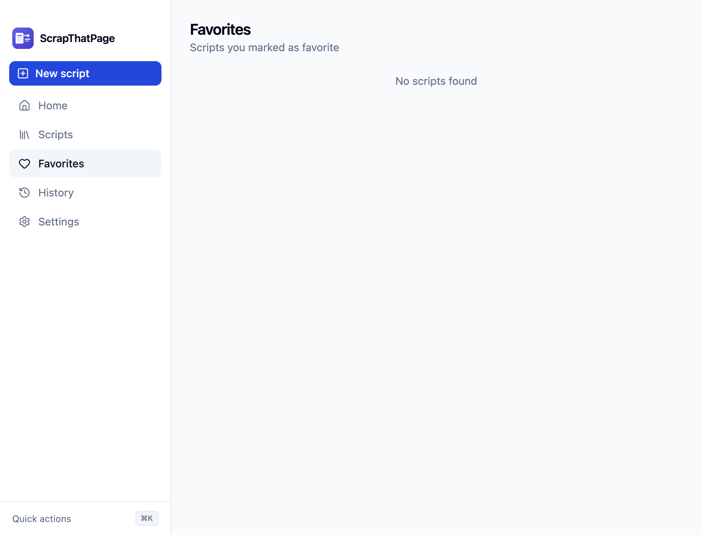
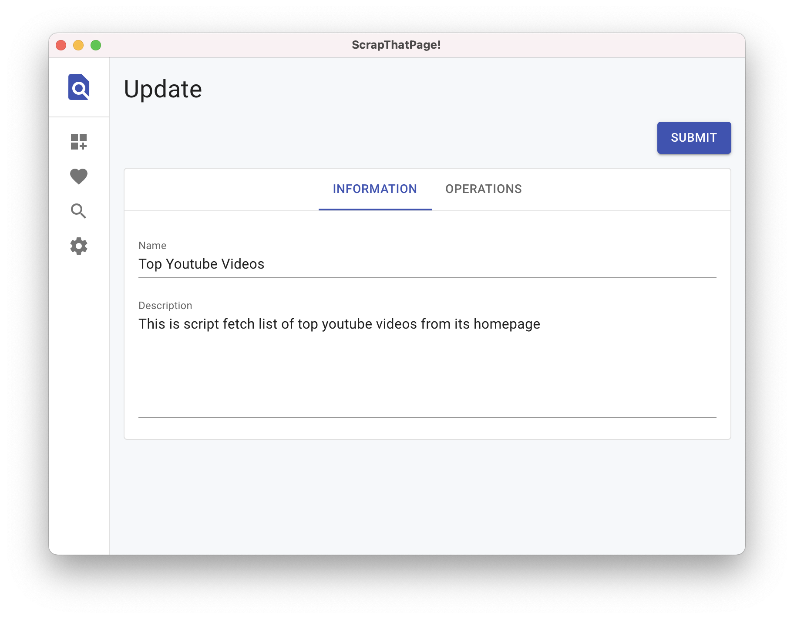
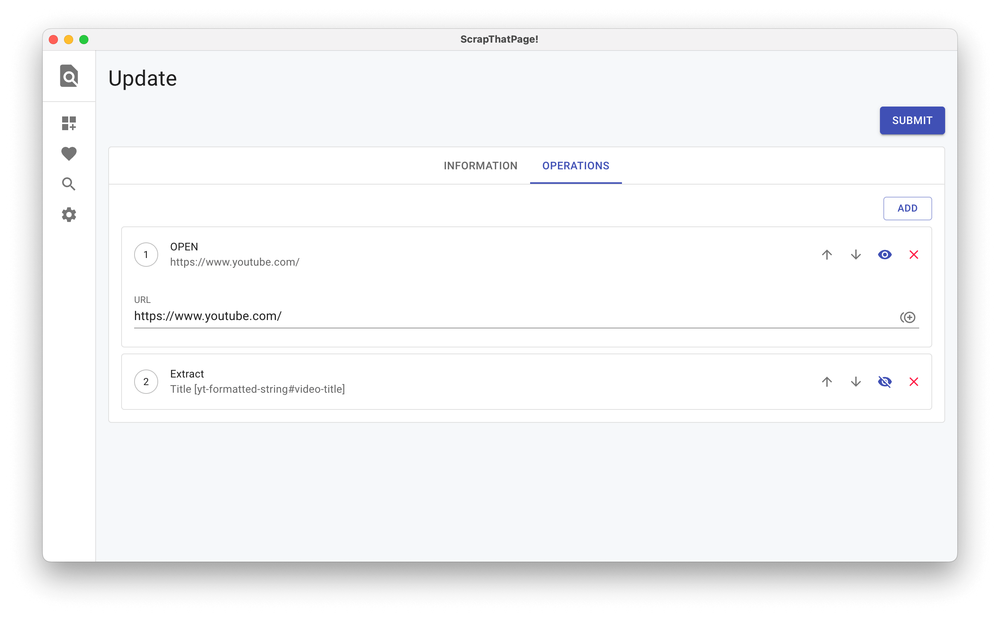
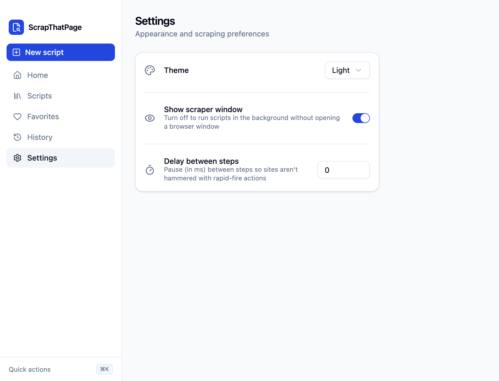
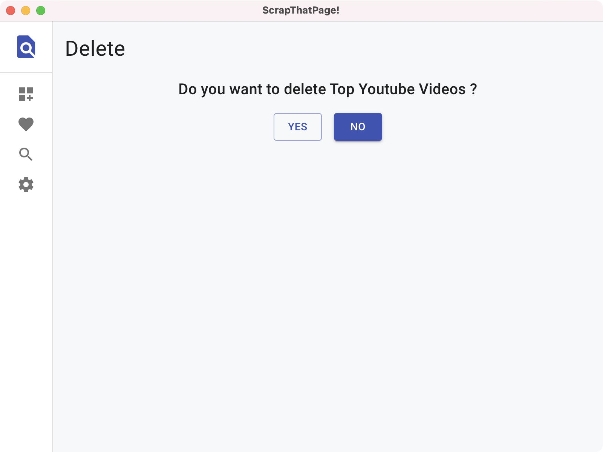

# ScrapThatPage

> A cross-platform desktop app for automating web scraping with simple, visual script actions — no code required.


ScrapThatPage lets you build reusable scraping **scripts** by stacking
operations — open a page, click, type, extract data — and run them against a
live browser window. Extracted data lands in a table you can export to CSV or
JSON. Scripts are saved locally, so everything runs on your machine.

## Screenshots

|  |  |
| --- | --- |
|  |  |
|  |  |

<details>
<summary>More screenshots</summary>







</details>

## Features

- **Visual script builder** — compose a script from operations without writing code.
- **Browser operations** — `open` a URL, `click` an element, `type` into a field, and `extract` values by CSS selector and attribute.
- **Variables & control flow** — `set`/`increase`/`decrease` variables and branch or loop with `if`/`while` (conditions are evaluated with [mathjs](https://mathjs.org/)).
- **Templating** — reference variables inside inputs with `{{variable}}` placeholders.
- **Results table** — extracted data is collected into a table and exported to **CSV** or **JSON**.
- **Library management** — create, update, delete, favorite, and search your saved scripts.
- **Local-first** — scripts are stored on-device in IndexedDB; nothing is sent anywhere.
- **Light & dark themes.**

## Tech stack

- [Electron](https://www.electronjs.org/) + [Electron Forge](https://www.electronforge.io/) (packaging) with [Vite](https://vite.dev/) (bundling)
- [React](https://react.dev/) + [Material UI](https://mui.com/)
- [Redux Toolkit](https://redux-toolkit.js.org/) (state) + [Dexie](https://dexie.org/) (IndexedDB)
- [TypeScript](https://www.typescriptlang.org/)

## Getting started

### Prerequisites

- [Node.js](https://nodejs.org/) 20.19+ (or 22.12+)
- [pnpm](https://pnpm.io/) 10+
- [git](https://git-scm.com/) (to clone the repository)

### Installation

```bash
git clone https://github.com/kaushalmeena/myapp-scrapthatpage.git
cd myapp-scrapthatpage
pnpm install
```

### Running in development

```bash
pnpm start
```

## Scripts

| Command | Description |
| --- | --- |
| `pnpm start` | Launch the app in development with hot reload. |
| `pnpm package` | Bundle the app into a platform-specific executable in `out/`. |
| `pnpm make` | Build distributable installers/archives for the current platform. |
| `pnpm lint` | Run ESLint. |
| `pnpm typecheck` | Type-check the project with `tsc` (no emit). |

## Building for distribution

```bash
pnpm make
```

Artifacts are written to `out/`. Forge is configured to produce a Squirrel
installer (Windows), a ZIP (macOS), and `.deb` / `.rpm` packages (Linux); build
on the target OS to produce that platform's package.

## License

Licensed under the MIT License — see [LICENSE](LICENSE) for details.
