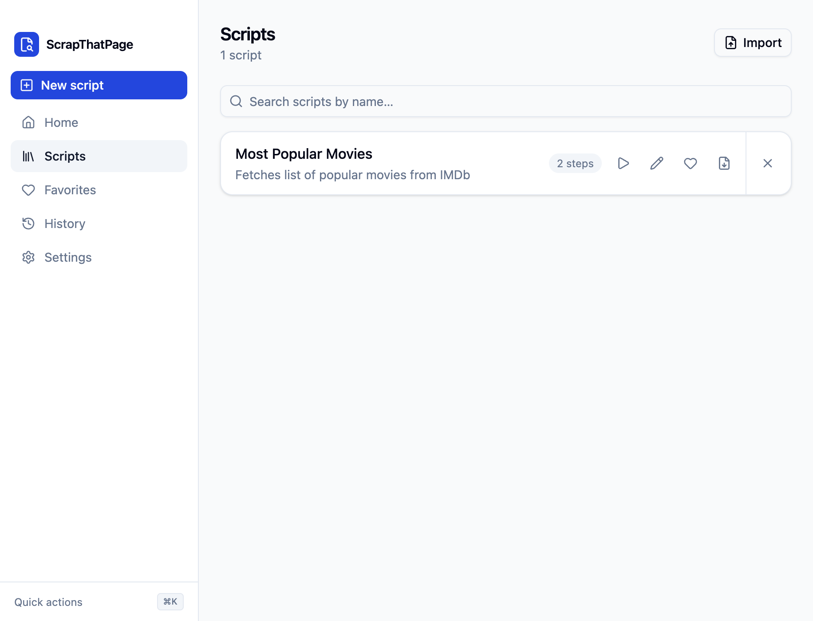
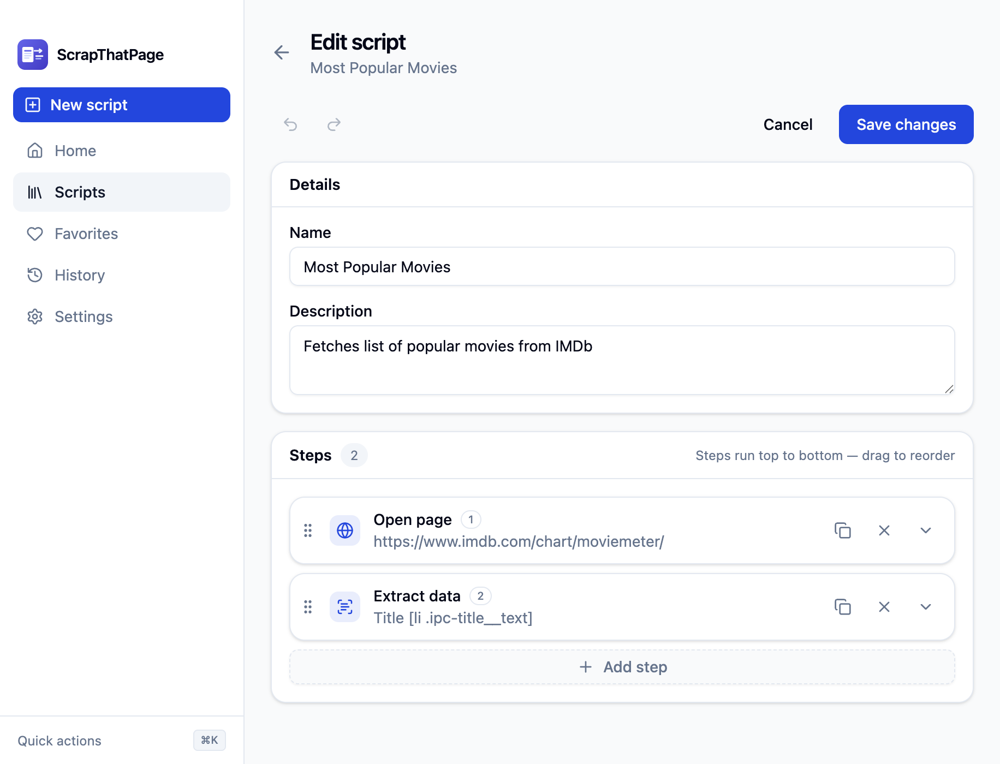
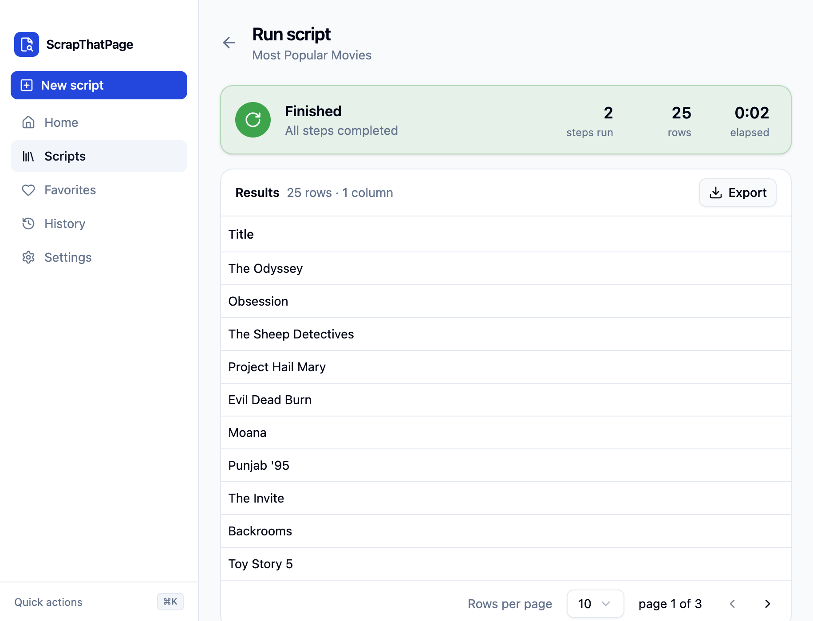
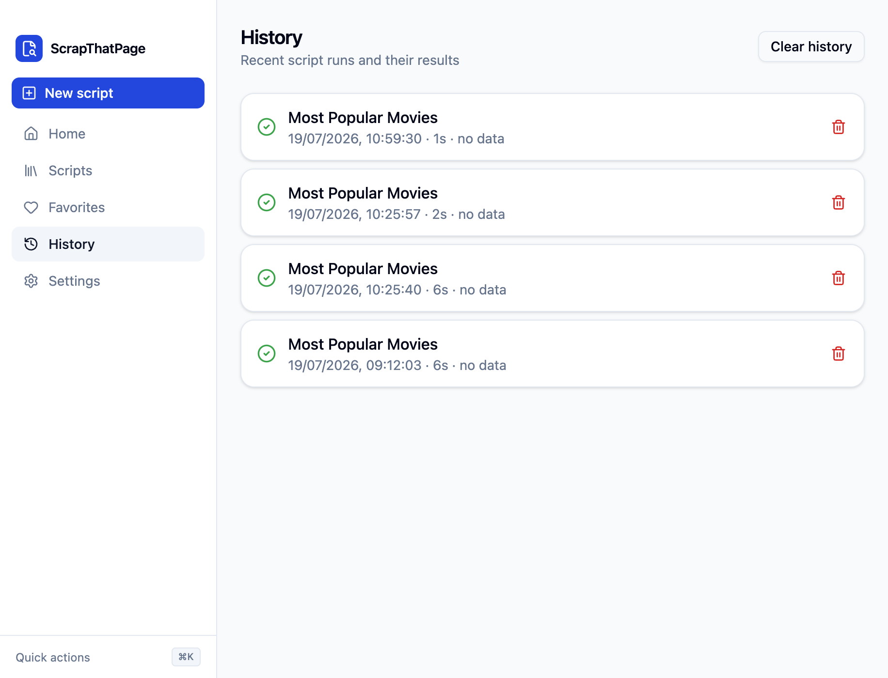

<div align="center">
  
  <h1>ScrapThatPage</h1>
  <p><strong>Point-and-click web scraping for the desktop — no code required.</strong></p>

  
  
  
  
</div>

ScrapThatPage lets you build reusable scraping **scripts** by stacking simple
steps — open a page, click, type, extract data — and run them against a real
browser window. Extracted values land in a table you can export or copy, every
run is saved to history, and scripts live locally on your machine.

## Screenshots

|                                   |                                       |
| --------------------------------- | ------------------------------------- |
|    |  |
|  |        |

<details>
<summary>More screenshots</summary>





</details>

## Features

- **Visual script builder** — compose a script step by step; drag to reorder,
  undo/redo, and a searchable step picker for adding operations.
- **Browser steps** — `open` a URL, `click` an element, `type` into a field,
  `extract` values by CSS selector and attribute, plus `wait` for an element,
  `delay`, and `scroll` (to an element or the page bottom to load lazy content).
- **Element picker** — click an element in the scraper window and its CSS
  selector is filled in for you.
- **Reliable execution** — steps auto-wait for their target to appear before
  acting; runs can be headless and paced with a configurable delay between steps.
- **Variables & control flow** — `set`/`increase`/`decrease` variables and
  branch or loop with `if`/`while` (conditions evaluated via
  [mathjs](https://mathjs.org/)); reference variables in inputs with
  `{{variable}}` placeholders.
- **Results table** — extracted data is collected into a table and exported to
  **CSV**, **JSON**, or **XLSX**, or copied to the clipboard.
- **Run history** — every run is recorded with its results and a per-step log.
- **Library management** — create, edit, delete, favorite, search, and
  import/export scripts as JSON.
- **Command palette** — `⌘/Ctrl-K` to jump anywhere or run/edit a script.
- **Local-first** — scripts and runs are stored on-device in IndexedDB; nothing
  leaves your machine.
- **Desktop feel** — native title bar, keyboard shortcuts, smooth animations,
  and light/dark themes.

## How scraping works

Scripts run in a dedicated Chromium window that ScrapThatPage drives over the
**Chrome DevTools Protocol** using Electron's in-process `webContents.debugger`.
That means no remote debugging port is opened, so scraping keeps working in the
signed, packaged app — while still getting Puppeteer-style ergonomics:
navigation waits for the document, actions auto-wait for their selector, clicks
and typing dispatch trusted input events, and hidden windows stay active so
lazily rendered content still loads.

## Tech stack

- [Electron](https://www.electronjs.org/) + [Electron Forge](https://www.electronforge.io/) (packaging) with [Vite](https://vite.dev/) (bundling)
- [React](https://react.dev/) + [shadcn/ui](https://ui.shadcn.com/) + [Tailwind CSS v4](https://tailwindcss.com/) + [Motion](https://motion.dev/) (animations)
- [Zustand](https://zustand.docs.pmnd.rs/) (state — with [zundo](https://github.com/charkour/zundo) for editor undo/redo) + [Dexie](https://dexie.org/) (IndexedDB) + [Zod](https://zod.dev/) (validation)
- [TypeScript](https://www.typescriptlang.org/) (strict) + [Vitest](https://vitest.dev/) (tests) + [Biome](https://biomejs.dev/) (lint & format)

## Getting started

### Prerequisites

- [Node.js](https://nodejs.org/) 20.19+ (or 22.12+)
- [pnpm](https://pnpm.io/) 10+
- [git](https://git-scm.com/) (to clone the repository)

### Installation

```bash
git clone https://github.com/kaushalmeena/scrap-that-page.git
cd scrap-that-page
pnpm install
```

### Running in development

```bash
pnpm start
```

## Scripts

| Command          | Description                                                        |
| ---------------- | ----------------------------------------------------------------- |
| `pnpm start`     | Launch the app in development with hot reload.                    |
| `pnpm package`   | Bundle the app into a platform-specific executable in `out/`.     |
| `pnpm make`      | Build distributable installers/archives for the current platform. |
| `pnpm lint`      | Lint the codebase with Biome.                                     |
| `pnpm format`    | Format the codebase with Biome.                                   |
| `pnpm check`     | Run Biome's combined lint + format + import-sort check.           |
| `pnpm typecheck` | Type-check the project with `tsc` (no emit).                      |
| `pnpm test`      | Run the Vitest test suite.                                        |

## Building for distribution

```bash
pnpm make
```

Artifacts are written to `out/`. Forge is configured to produce a Squirrel
installer (Windows), a ZIP (macOS), and `.deb` / `.rpm` packages (Linux); build
on the target OS to produce that platform's package.

## License

Licensed under the MIT License — see [LICENSE](LICENSE) for details.
