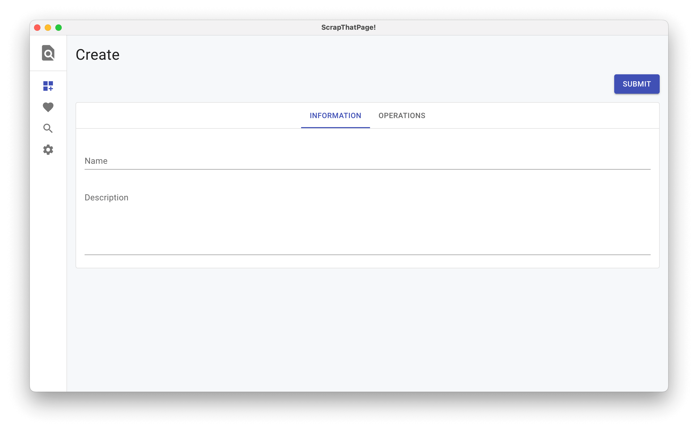
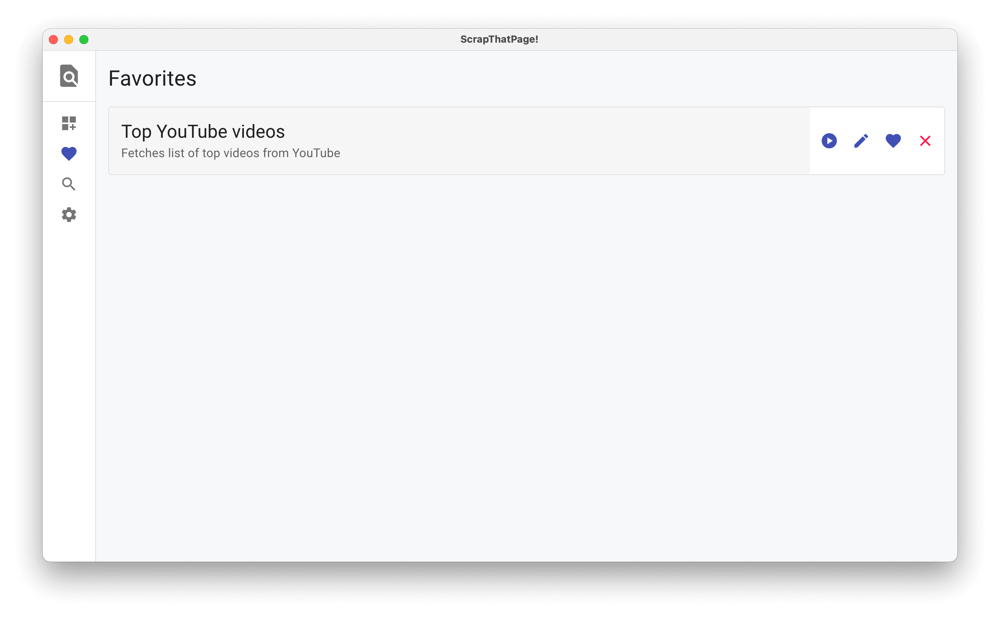
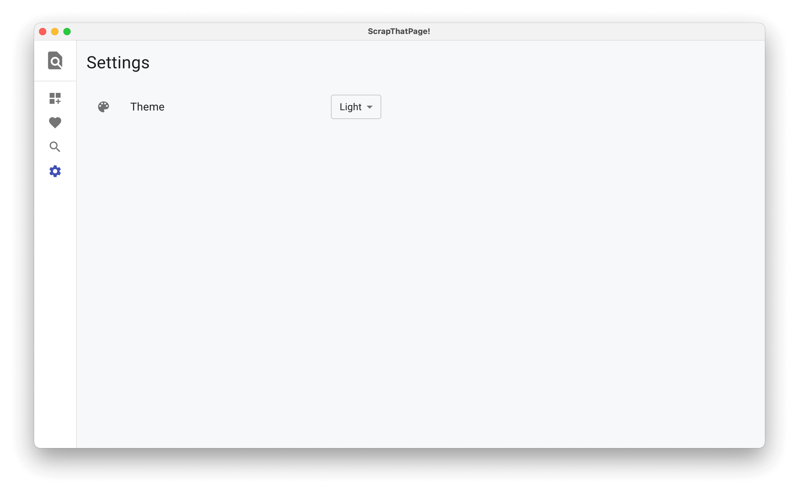

# ScrapThatPage

A desktop app that automates web scraper with easy to use script actions.

## Getting Started

These instructions will get you a copy of the project up and running on your local machine for development purposes.

### Requirements

To install and run this project you need:

- [Node.js](https://nodejs.org/ "Node.js")
- [yarn](https://classic.yarnpkg.com/lang/en/docs/install/ "yarn") 
- [git](https://git-scm.com/downloads "git") (only to clone this repository)

### Installation

To set up everything in your local machine, you need to follow these steps:

1. Clone this repo and then change directory to the `myapp-scrapthatpage` folder:

```bash
$ git clone https://github.com/kaushalmeena/myapp-scrapthatpage.git
$ cd myapp-scrapthatpage
```

2. Install project dependencies using yarn:

```bash
$ yarn install
```

### Running

To run the project simply run:

```bash
$ yarn run start
```

## Screenshots

 






## Built With

- [Electron](https://www.electronjs.org/)
- [React](https://reactjs.org/)
- [Material UI](https://mui.com/)

## License

This project is licensed under the MIT License - see the [LICENSE](LICENSE) file for details.
